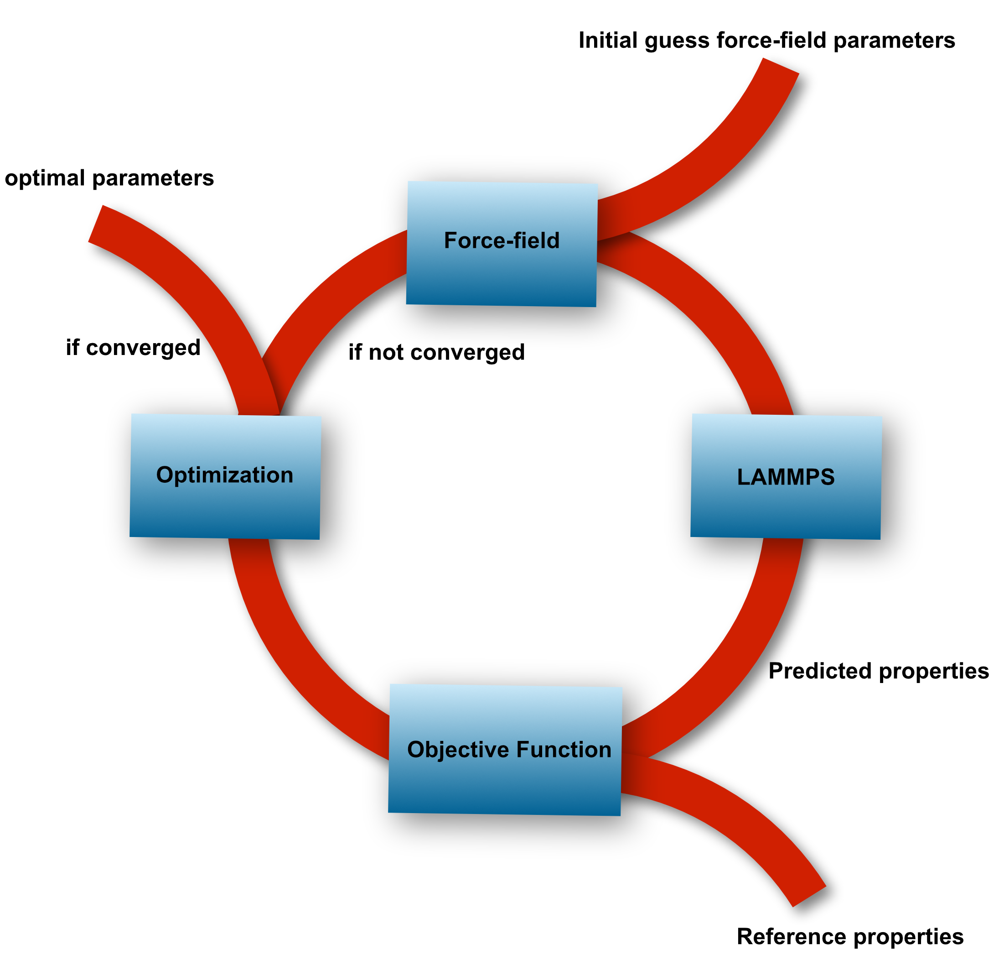

# A data-driven approach to systematically and reproduciably optimize force-field parameters 

## Features: 

* Externally launch third-parties simulation packages in parallel    

## Installation: 

* conda install -c conda-forge optimize 

## Software required:

* compiled LAMMPS executable 

* Slurm Workload Manager  

* Numpy  

* Python/3.7  
