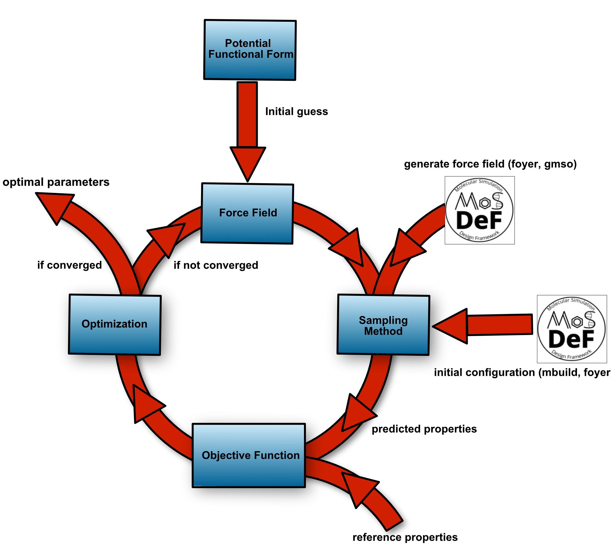

# A data-driven approach to systematically and reproduciably optimize force-field parameters 

## Features: 
* Efficient adoption of parallism for invoking existing parallel simulators to perform sampling  
* Flexible inclusions of distinct physical properties as reference data  
* Diverse choices of potential functional forms implemented in the parallel simulators
* Modular design to facilitate the exstensions with user-defined:  
    - objective functional forms 
    - sampling methods/force-field potential functional forms
    - optimization algorithms  

## Installation: 

* conda install -c conda-forge optimize (not official)

## Software required:

* A compiled MD/MC packages exectuable (LAMMPS is already supported) 

* Slurm Workload Manager (or equivalent) 

* Numpy  

* Python/3.7  

## References: 

[1]: Chan, H., Cherukara, M. J., Narayanan, B., Loeffler, T. D., Benmore, C., Gray, S. K., & Sankaranarayanan, S. K. R. S. (2019). Machine learning coarse grained models for water. Nature Communications, 10(1), 379. https://doi.org/10.1038/s41467-018-08222-6 

[2]: Gao, F., & Han, L. (2012). Implementing the Nelder-Mead simplex algorithm with adaptive parameters. Computational Optimization and Applications, 51(1), 259–277. https://doi.org/10.1007/s10589-010-9329-3   

[3]: Wang, L.P., Chen, J., & Van Voorhis, T. (2013). Systematic Parametrization of Polarizable Force Fields from Quantum Chemistry Data. Journal of Chemical Theory and Computation, 9(1), 452–460. https://doi.org/10.1021/ct300826t  

[4]: Ercolessi, F., & Adams, J. B. (1994). Interatomic Potentials from First-Principles Calculations: The Force-Matching Method. Europhysics Letters ({EPL}), 26(8), 583–588. https://doi.org/10.1209/0295-5075/26/8/005  

[5]: Sundararaman, S., Huang, L., Ispas, S., & Kob, W. (2018). New optimization scheme to obtain interaction potentials for oxide glasses. Journal of Chemical Physics, 148(19). https://doi.org/10.1063/1.5023707 
